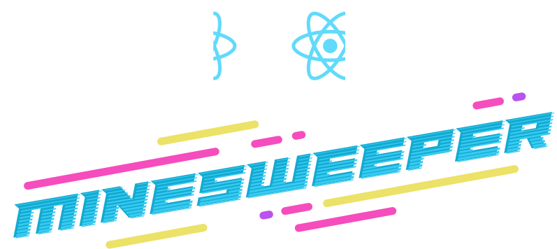

# Minesweeper

Remember Minesweeper? It's back. Built with React and Tailwind CSS and sporting a sleek dark theme, this app will have you sweeping mines for hours.

## How to Play

### Starting the Game

You can start a new game in one of two ways:

1. Choose your number of columns, rows, and mines, and then click the Play button.
2. Or, Enter a UUID in the input below and click Start to have a consistently generated psuedorandom game board. This means you can play the same game over and over!

### Playing the Game

1. Click on any cell to sweep it.
2. To flag a cell as dangerous, click while pressing the Shift key on your keyboard
3. If you click on a mine, you lose!
4. But if you can sweep all the safe cells, you win!

## Running Locally

1. Clone the repo
2. `yarn install`
3. `yarn start`

## Features

- 100% test coverage
- WCAG 2.1 AA compliant
- Dark theme
- Mobile responsive
- Keyboard navigable
- Accepts a UUID for pseudorandom game board generation
- HTML5 form validation
- Prettier for code formatting
- Git hooks and linting using Husky, Commitlint, and lint-staged
- Commit message CLI using Commitizen
- README badges

## Local Development

- "build": builds the app
- "build:tailwind": builds the Tailwind CSS output
- "commit": commits using the Commitizen CLI
- "eject": ejects from React Scripts (Create React App)
- "format": formats the app using Prettier
- "format-watch": runs Prettier in watch mode
- "start": builds the Tailwind CSS output and starts the app
- "start:react": starts the app without building the Tailwind CSS
- "test": runs tests in watch mode
- "test:coverage": runs tests not in watch mode and collects coverage
- "watch:tailwind": builds the Tailwind CSS output in watch mode
